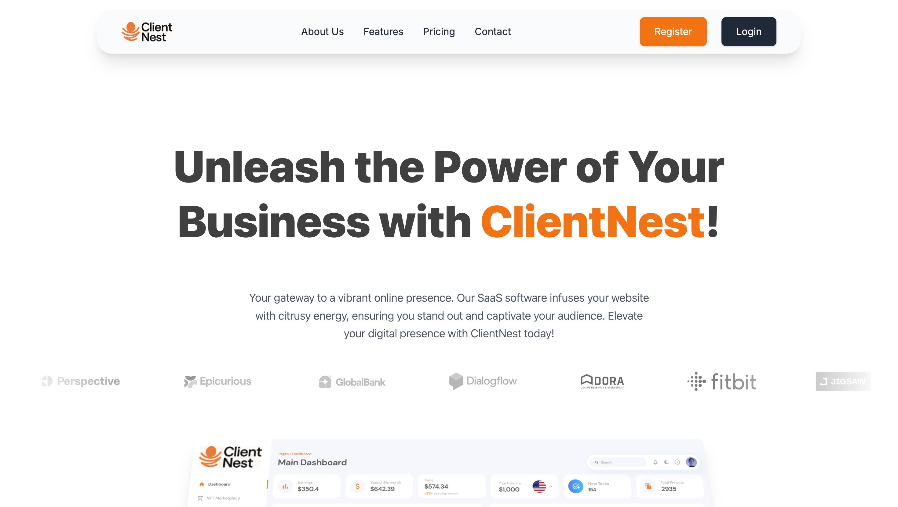

# 🧠 ClientNest – AI-Enhanced CRM Software

ClientNest is a modern, elegant CRM platform built with **React**, **Vite**, **Tailwind CSS**, and **Framer Motion**, designed to streamline business workflows through:
- 🔁 Automation
- 📊 Advanced Analytics
- 📇 Contact & Task Management
- 🎯 Marketing Integration
- 💡 Smart UI/UX

---

## 📸 Preview

  

---

## 🚀 Tech Stack

- ⚛️ React + Vite
- 🎨 Tailwind CSS + ShadCN
- 🧩 Framer Motion
- 🔐 React Router + Context API
- 🧠 DnD Kit + Date-fns

---

## 🛠️ Features

- ✅ Dashboard with analytics
- 👥 Contacts & tasks system
- ⚙️ Data management & automation
- 🌙 Light/Dark theme toggle
- 📈 Customizable charts

---

## 📂 Folder Structure
src/
├── assets/
├── components/
├── context/
├── pages/
└── App.jsx
---

## 🤝 Contribute

Want to contribute or use it for your team?  
Feel free to fork, star ⭐, or open issues!

---

## 📬 Contact

Made with ❤️ by [Alok Mishra](https://github.com/Alok0027)

---

## 🌐 Live Demo
👉 [clientnest.vercel.app](https://clientnestcrm.vercel.app/) <!-- Replace with your URL -->